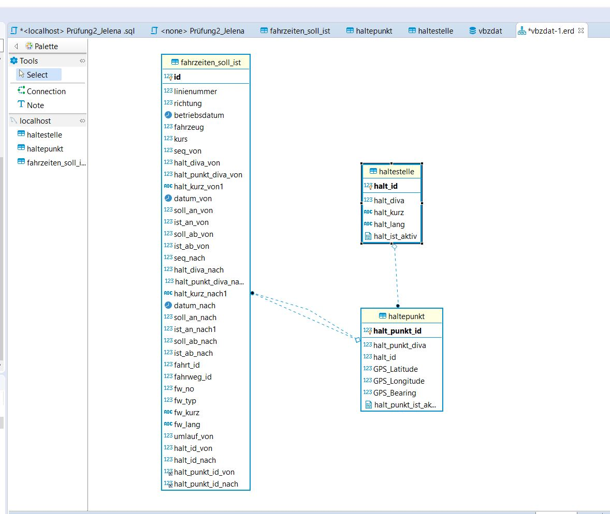
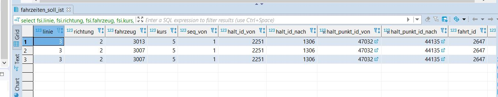

# VBZ
Datenbank - Prüfung VBZ
a6bereinigung_Tabellen.sgl
-- aufgabe 6 

ALTER TABLE vbzdat.haltepunkt ADD CONSTRAINT haltepunkt_FK FOREIGN KEY (halt_id) REFERENCES haltestelle (halt_id);
-- neue Spalte in der Tabellle finzufügen als primary key

ALTER TABLE vbzdat.fahrzeiten_soll_ist ADD id INT primary key auto_increment first;

--einfügen der FOREIGN KEY CONSTRAINTS farzeiten_soll_ist nach haltepunkt

alter table vbzdat.fahrzeiten_soll_ist add constraint fahrzeiten_soll_ist_FK foreign key (halt_punkt_id_von) references haltpunkt(halt_punkt_id);
alter table vbzdat.fahrzeiten_soll_ist add constraint fahrzeiten_soll_ist_FK_1 foreign key (halt_punkt_id_nach) references haltepunkt(halt_punkt_id);

-- Foreign key haltepunkt nach haltestelle 

ALTER TABLE vbzdat.haltepunkt ADD CONSTRAINT haltepunkt_FK FOREIGN KEY (halt_id) REFERENCES haltestelle (halt_id);

-- datum iz String forme i sekunde (  00.00.00) prebaciti u pravi datentyp, tako ste ce se dodati nove kolone 

alter table vbzdat.fahrzeiten_soll_ist add betriebs_datum date null;
alter table vbzdat.fahrzeiten_soll_ist add datumzeit_soll_an_von datetime null;
alter table vbzdat.fahrzeiten_soll_ist add datumzeit_ist _an_von datetime null;
alter table vbzdat.fahrzeiten_soll_ist add datumzeit_soll_ab_von datetime null;
alter table vbzdat.fahrzeiten_soll_ist add datumzeit_ist_ab_von datetime null;
alter table vbzdat.fahrzeiten_soll_ist add datum_nach date null;

-- Datentyp  konvertierung

update vbzdat.fahrzeiten_soll_ist set betriebs_datum = STR_TO_DATE (betriebsdatum , '%d.%m.%Y');
update vbzdat.fahrzeiten_soll_ist set datumzeit_soll_an_von = DATE_ADD (STR_TO_DATE(datum_von ,'%d.%m.%Y'), interval soll_an_von second );
update vbzdat.fahrzeiten_soll_ist set datumzeit_an_von = DATE_ADD (STR_TO_DATE (datum_von , '%d.%m.%Y'), interval ist_an_von second );
update vbzdat.fahrzeiten_soll_ist set datumzeit_ist_ab_von = DATE_ADD (STR_TO_DATE(datum_von , '%d.%m.%Y'), interval ist_an_von second );
update vbzdat.fahrzeiten_soll_ist set datum_nach = STR_TO_DATE(datum_nach ,'%d.%m.%Y' );

-- Aufgaben 7 - Linie 3 😊

select
    fsi.linienummer
from
    vbzdat.fahrzeiten_soll_ist fsi;

    vbzdat.fahrzeiten_soll_ist fsi;

dd datumzeit_soll_an_von datetime null;
alter table vbzdat.fahrzeiten_soll_ist add datumzeit_ist _an_von datetime null;
alter table vbzdat.fahrzeiten_soll_ist add datumzeit_soll_ab_von datetime null;
alter table vbzdat.fahrzeiten_soll_ist add datumzeit_ist_ab_von datetime null;
alter table vbzdat.fahrzeiten_soll_ist add datum_nach date null;

update vbzdat.fahrzeiten_soll_ist set betriebs_datum = STR_TO_DATE (betriebsdatum , '%d.%m.%Y');
update vbzdat.fahrzeiten_soll_ist set datumzeit_soll_an_von = DATE_ADD (STR_TO_DATE(datum_von ,'%d.%m.%Y'), interval soll_an_von second );
update vbzdat.fahrzeiten_soll_ist set datumzeit_ist_an_von = DATE_ADD (STR_TO_DATE (datum_von , '%d.%m.%Y'), interval ist_an_von second );
update vbzdat.fahrzeiten_soll_ist set datumzeit_ist_ab_von = DATE_ADD (STR_TO_DATE(datum_von , '%d.%m.%Y'), interval ist_an_von second );
update vbzdat.fahrzeiten_soll_ist set datum_nach = STR_TO_DATE(datum_nach ,'%d.%m.%Y' );

select
    fsi.linie,
    fsi.richtung,
    fsi.fahrzeug,
    fsi.kurs,
    fsi.seq_von,
    fsi.halt_id_von,
    fsi.halt_id_nach,
    fsi.halt_punkt_id_von,
    fsi.halt_punkt_id_nach,
    fsi.fahrt_id,
    fsi.fahrweg_id,
    fsi.fw_no,
    fsi.fw_typ,
    fsi.fw_kurz,
    fsi.fw_lang,
    fsi.betriebs_datum,
    fsi.datumzeit_soll_an_von,
    fsi.datumzeit_ist_an_von,
    fsi.datumzeit_soll_ab_von,
    fsi.datumzeit_ist_ab_von,
    fsi.datum_nach,
    TIMEDIFF(datumzeit_soll_an_von,
    datumzeit_ist_an_von) as timediff_an,
    TIMESTAMPDIFF(second,
    datumzeit_soll_an_von,
    datumzeit_ist_an_von) as timediff_an_seconds,
    TIMEDIFF(datumzeit_soll_ab_von,
    datumzeit_ist_ab_von) as timediff_ab,
    TIMESTAMPDIFF(second,
    datumzeit_soll_ab_von,
    datumzeit_ist_ab_von) as timediff_ab_seconds,
    TIMESTAMPDIFF(second,
    datumzeit_soll_an_von,
    datumzeit_soll_ab_von) as halt_soll_time_seconds,
    TIMESTAMPDIFF(second,
    datumzeit_ist_an_von,
    datumzeit_ist_ab_von) as halt_ist_time_seconds
from
    fahrzeiten_soll_ist fsi
where
    fsi.linie = 3
    and fsi.fahrt_id = 2647
    
limit 40000;

