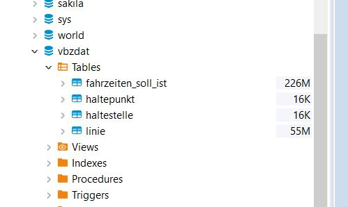

# VBZ
Datenbank - Prüfung VBZ
  Aufgabe 6 
  
alter table fahrzeiten_soll_ist add id INT primary key auto_increment first; 

alter table fahrzeiten_soll_ist add constraint fahrzeiten_soll_ist_FK foreign key
(halt_punkt_id_von) references haltepunkt(halt_punkt_id);

alter table fahrzeiten_soll_ist add constraint fahrzeiten_soll_ist_FK_1 foreign key
(halt_punkt_id_nach) references haltepunkt(halt_punkt_id);

alter table haltepunkt add constraint haltepunkt_FK foreign key (halt_id)
references haltestelle(halt_id);

alter table fahrzeiten_soll_ist add betriebs_datum DATE NULL; 
alter table fahrzeiten_soll_ist add datumzeit_soll_an_von DATETIME NULL; 
alter table fahrzeiten_soll_ist add datumzeit_ist_an_von DATETIME NULL; 
alter table fahrzeiten_soll_ist add datumzeit_soll_ab_von DATETIME NULL;
alter table fahrzeiten_soll_ist add datumzeit_ist_ab_von DATETIME NULL; 
alter table fahrzeiten_soll_ist add datum__nach DATE NULL;

update fahrzeiten_soll_ist set betriebs_datum = STR_TO_DATE(betriebsdatum ,'%d.%m.%Y');
update fahrzeiten_soll_ist set datumzeit_soll_an_von = DATE_ADD(STR_TO_DATE(datum_von ,'%d.%m.%Y'), interval soll_an_von SECOND);
update fahrzeiten_soll_ist set datumzeit_ist_an_von = DATE_ADD(STR_TO_DATE(datum_von ,'%d.%m.%Y'), interval ist_an_von SECOND);
update fahrzeiten_soll_ist set datumzeit_soll_ab_von = DATE_ADD(STR_TO_DATE(datum_von ,'%d.%m.%Y'), interval soll_ab_von SECOND);
update fahrzeiten_soll_ist set datumzeit_ist_ab_von = DATE_ADD(STR_TO_DATE(datum_von,'%d.%m.%Y'), interval ist_ab_von SECOND);
update fahrzeiten_soll_ist set datum__nach =STR_TO_DATE(datum_nach ,'%d.%m.%Y');

-- Aufgabe 7 - Zeitdifferinzierung  Linie 3 , fahrt_id 2647

select
    fsi.linie,
    fsi.richtung,
    fsi.fahrzeug,
    fsi.kurs,
    fsi.seq_von,
    fsi.halt_id_von,
    fsi.halt_id_nach,
    fsi.fahrt_id,
    fsi.fahrweg_id,
    fsi.fw_no,
    fsi.fw_typ,
    fsi.fw_kurz,
    fsi.fw_lang,
    fsi.betriebsdatum,
    fsi.datumzeit_soll_an_von,
    fsi.datumzeit_ist_an_von,
    fsi.datumzeit_soll_ab_von,
    fsi.datumzeit_ist_ab_von,
    fsi.datum__nach,
    TIMEDIFF (datumzeit_soll_an_von,datumzeit_ist_an_von) as timediff_an,
    TIMESTAMPDIFF (second, datumzeit_soll_an_von, datumzeit_ist_an_von) as timediff_an_seconds,
    TIMEDIFF (datumzeit_soll_ab_von, datumzeit_ist_ab_von) as timediff_ab,
    TIMESTAMPDIFF(second, datumzeit_soll_ab_von, datumzeit_ist_ab_von) as timediff_ab_seconds,
    TIMESTAMPDIFF(second, datumzeit_soll_an_von, datumzeit_soll_ab_von) as halt_soll_time_seconds,
    TIMESTAMPDIFF(second, datumzeit_ist_an_von, datumzeit_ist_ab_von) as halt_ist_time_secondsFROM
from
   vbzdat.fahrzeiten_soll_ist fsi 
where
    fsi.linie = 3
    and fsi.fahrt_id = 2647
    
limit 40000;

-- Aufgabe 8 

--- Linie 3 Abfrage

select distinct
    fsi.linie,
    fsi.richtung,
    fsi.fw_no,
    fsi.fw_lang 
from
    vbzdat.fahrzeiten_soll_ist fsi
where
    fsi.linie = 3
limit 40000;

--- View query_line 

create view query_line3
as select 
    fsi.linie,
    fsi.richtung,
    fsi.fw_no,
    fsi.fw_lang
from 
   vbzdat.fahrzeiten_soll_ist fsi
where 
    fsi.linie = 3
    
  
  
    
  ---- Tabellenerstellungsabfragen -linie
    
 create table linie 

select 
     fsi.fahrweg_id,
     fsi.linie,
     fsi.richtung,
     fsi.fw_no,
     fsi.fw_lang
from
    vbzdat.fahrzeiten_soll_ist fsi;
   
 alter  table linie add fahrweg_id INT primary key auto_increment first;  
   
      
